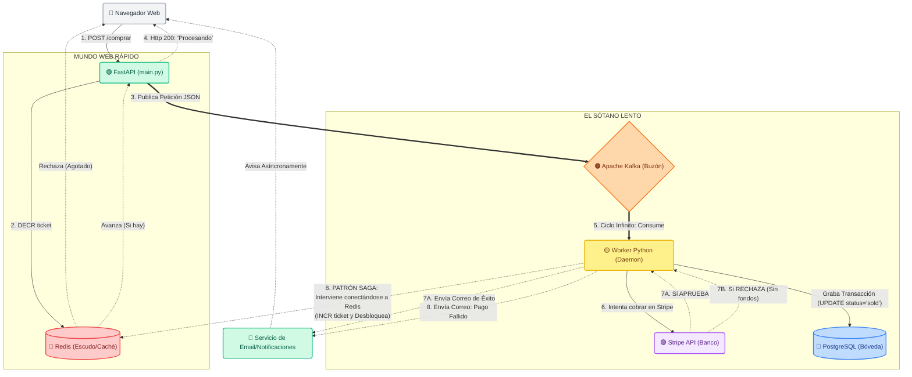

# Arquitectura Asíncrona Ticketmaster

A continuación se muestra el diagrama de nuestra arquitectura:

```mermaid
graph TD
    classDef frontend fill:#f3f4f6,stroke:#9ca3af,stroke-width:2px,color:#1f2937
    classDef api fill:#d1fae5,stroke:#10b981,stroke-width:2px,color:#065f46
    classDef cache fill:#fecaca,stroke:#ef4444,stroke-width:2px,color:#7f1d1d
    classDef queue fill:#fed7aa,stroke:#f97316,stroke-width:2px,color:#7c2d12
    classDef worker fill:#fef08a,stroke:#eab308,stroke-width:2px,color:#713f12
    classDef db fill:#bfdbfe,stroke:#3b82f6,stroke-width:2px,color:#1e3a8a
    classDef ext fill:#f3e8ff,stroke:#a855f7,stroke-width:2px,color:#581c87

    Client("📱 Navegador Web"):::frontend
    API("🟢 FastAPI (main.py)"):::api
    Redis[("🔴 Redis (Escudo/Caché)")]:::cache
    Kafka{"🟠 Apache Kafka (Buzón)"}:::queue
    Worker("🟡 Worker Python (Daemon)"):::worker
    Stripe("🟣 Stripe API (Banco)"):::ext
    PG[("🔵 PostgreSQL (Bóveda)")]:::db
    Push("📧 Servicio de Email/Notificaciones"):::api

    subgraph Mundo Síncrono [MUNDO WEB RÁPIDO]
        direction LR
        API
        Redis
    end

    subgraph Mundo Asíncrono [EL SÓTANO LENTO]
        direction LR
        Kafka
        Worker
        Stripe
        PG
    end

    Client -- "1. POST /comprar" --> API
    
    API -- "2. DECR ticket" --> Redis
    Redis -. "Rechaza (Agotado)" .-> Client
    Redis -. "Avanza (Si hay)" .-> API
    
    API == "3. Publica Petición JSON" ==> Kafka
    API -. "4. Http 200: 'Procesando'" .-> Client
    
    Kafka == "5. Ciclo Infinito: Consume" ==> Worker
    Worker -- "6. Intenta cobrar en Stripe" --> Stripe
    
    Stripe -. "7A. Si APRUEBA" .-> Worker
    Worker -- "Graba Transacción (UPDATE status='sold')" --> PG
    Worker -. "7A. Envía Correo de Éxito" .-> Push
    
    Stripe -. "7B. Si RECHAZA (Sin fondos)" .-> Worker
    Worker -. "8. PATRÓN SAGA: Interviene conectándose a Redis<br>(INCR ticket y Desbloquea)" .-> Redis
    Worker -. "8. Envía Correo: Pago Fallido" .-> Push
    
    Push -. "Avisa Asíncronamente" .-> Client
```
